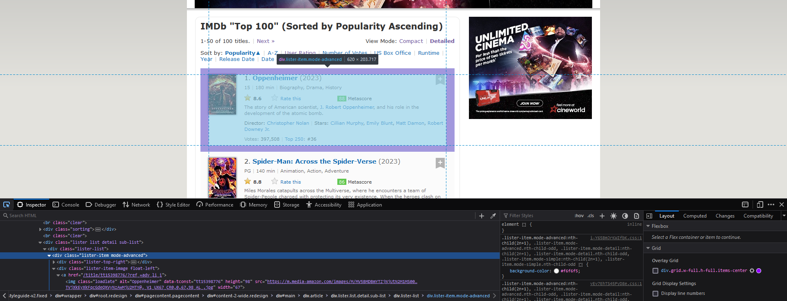

# IMDB Top 100 Movies

This project is Data Scraping using Python BeautifulSoup.





### Packages used:

- BeautfiulSoup
- Pandas
- NumPy
- requests


### Run the python script using the following command:

```commandline
python main.py
```

### Clone this Repo:
```commandline
git clone https://github.com/zmohamed1905/IMDB_Top_100_Movies.git
```